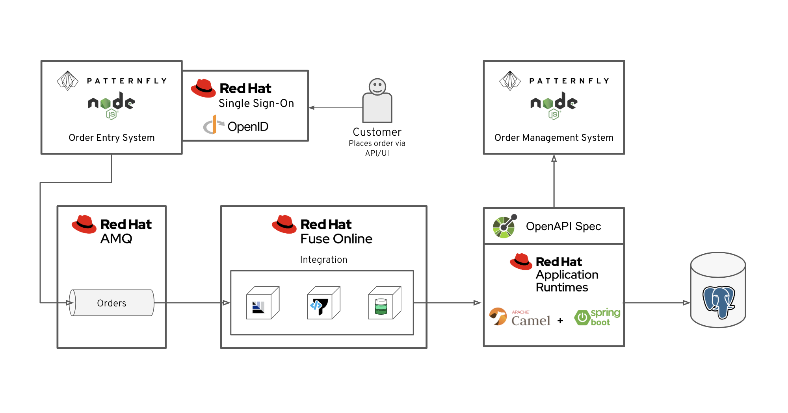

sso-realm-url {user-sso-url}/auth/admin/{user-sanitized-username}/console/index.html
:sso-adapter-docs-url: https://access.redhat.com/documentation/en-us/red_hat_single_sign-on/7.3/html/securing_applications_and_services_guide/index

= 1B - Protecting Applications using Red Hat Single Sign-On (SSO)

This Solution Pattern demonstrates how Red Hat SSO can be used to protect web applications by providing single sign-on capabilities based on popular standards such as SAML 2.0, OpenID Connect and OAuth 2.0.

NOTE: You must complete the *Integrating message-oriented middleware with a RESTful API using AMQ Online* Solution Pattern prior to starting this one.

Each Red Hat Managed Integration cluster includes two Red Hat SSO instances.
One is known as the *Cluster SSO* instance and is used to provide
authentication to the RHMI cluster and middleware services running on it. The
second instance is referred to as the *User-Facing SSO* instance and can be
used by developers to secure applications they deploy on the cluster, or even
on other infrastructure.

In this Solution Pattern the *User-Facing SSO* is used to enable
authentication and authorisation for the *Order Entry System* and the *Order
Management System* from the *Integrating message-oriented middleware with a
RESTful API using AMQ Online* Solution Pattern.

[type=walkthroughResource,serviceName=openshift]
.Red Hat OpenShift
****
* link:{openshift-host}/console[Console, window="_blank"]
* link:https://help.openshift.com/[OpenShift Online Help Center, window="_blank"]
* link:https://blog.openshift.com/[OpenShift Blog, window="_blank"]
****

[type=walkthroughResource,serviceName=3scale]
.User-Facing SSO
****
* link:sso-realm-url[SSO Realm Console, window="_blank"]
* link:https://access.redhat.com/products/red-hat-single-sign-on/[Red Hat SSO Overview, window="_blank"]
****

:sectnums:

[time=15]
== Creating a Client and User in Red Hat SSO

Red Hat SSO uses *Realms* to manage *Clients*, *Roles*, *Users* and *Groups*. A
user belongs to and logs into a realm. Realms are isolated from one another and
can only manage and authenticate the users that they control.

A realm has already been created for this Solution Pattern and user.

=== Create a Client

Securing an application using Red Hat SSO requires a *Client* to be created in
a *Realm*. The *Client* represents the application being secured and contains
important details regarding the security applied to the application.

. Navigate to the link:sso-realm-url[Red Hat SSO Realm, window="_blank"].
. Enter the username `{user-username}` and password `password` if prompted.
. Details for realm named {user-username} are displayed upon login success.
. Select *Clients* from the menu on the left.
. Click the *Create* button at the top of the list of clients to display the *Add Client* screen:
.. Enter `order-entry-system` in the *Client ID* field.
.. Verify *Client Protocol* is set to `openid-connect`.
.. Paste the URL of the *Order Entry System* from the previous Solution Pattern in the *Root URL* field. This should look similar to `https://order-entry-ui-<NAMESPACE>.{openshift-app-host}`
.. Click *Save*.
. The *Settings* screen for the `order-entry-system` client should be displayed.
. Verify that the *Access Type* field is set to `public`. This means the client is a frontend application that needs to login via a web browser.

[type=verification]
Select the *Clients* item in the side menu. The `order-entry-system` client should be listed and *Enabled* should be `True`.

[type=verificationFail]
Verify that you followed each step in the procedure above and that the *Enabled* toggle in the *Client* is set to *ON*. If you are still having issues, contact your administrator.

=== Create a User

Red Hat Single Sign-On provides identity brokering functionality. Identity
brokering facilitates login using a shared identity. For example, it's possible
to create an *Identity Provider* in a *Realm* in Red Hat SSO to enable login
using social identities such as Google, Twitter, or GitHub. When the user
chooses to login using an *Identity Provider* a *User* is automatically created
in the Red Hat SSO *Realm* with the details from their chosen
*Identity Provider*.

In this Solution Pattern a *User* will be created manually to keep things
simple.

. Navigate to the link:sso-realm-url[Red Hat SSO Realm, window="_blank"].
. Enter the username `{user-username}` and password `password` if prompted.
. Select the *Users* entry in the side menu.
. Click *Add user*.
.. Enter the username `customer`.
.. Leave other fields with their default values and click *Save*.
. The `customer` user details should now be displayed with tabs along the top of the UI.
. Select the *Credentials* tab.
.. Enter the password `customer-password` in the *New Password* field.
.. Enter the same password in the *Password Confirmation* field.
.. Set the *Temporary* toggle to the *OFF* position.
.. Click the *Reset Password* button.
.. When prompted click the *Change password* button in the modal.

[type=verification]
Select the *Users* item in the side menu. Click the *View all users* button. The `customer` user should be listed.

[type=verificationFail]
Verify that you followed each step in the procedure above. If you are still having issues, contact your administrator.

[time=15]
== Enabling Red Hat SSO in the Order Entry System

=== Obtaining the Red Hat SSO Configuration

To secure an application with Red Hat SSO a *Client Adapter* is required.
Various platforms are supported with *Client Adapters*:

. Spring Boot
. Node.js
. JBoss EAP
. Fuse
. JavaScript (client-side)
. Servlet Filter

The *Order Entry System* is run from a Node.js server, so the Node.js
`keycloak-connect` adapter is included in the code. The following steps will
demonstrate how to include a configuration and enable the adapter.

NOTE: Enabling the adapter can vary depending on how an application has been
coded. The Order Entry System has been developed to disable Red Hat SSO
protection if a configuration is not found on startup. For a real application
this may not be advisable.

. Navigate to the link:{sso-realm-url}[Red Hat SSO Realm, window="_blank"].
. Enter the username `{user-username}` and password `password` if prompted. 
. Select *Clients* from the side menu.
. Click the `order-entry-system` client that was created earlier.
. Open the *Installation* tab.
. Select *Keycloak OIDC JSON* for *Format Option*.
. Click the *Download* button to download this as a _keycloak.json_ file.

=== Creating a Red Hat SSO Config Map Entry

. Login to the link:{openshift-host}/console/[OpenShift Console, window="_blank"].
. Select the *walkthroughs-1A* project.
. Select *Resources > Config Maps*.
. Click the *Create Config Map*  button.
.. Enter `order-entry-keycloak-config` in the *Name* field.
.. Enter `KEYCLOAK_CONFIG` in the *Key* field.
.. Click the *Browse* button and select the _keycloak.json_ file that was downloaded in the previous section.
. Click the *Create* button.

=== Applying the Red Hat SSO Config Map

. Login to the link:{openshift-host}/console/[OpenShift Console, window="_blank"].
. Navigate to the *walkthroughs-1A* project.
. Select *Applications > Deployments*.
. Select the *rhmi-lab-nodejs-order-frontend* item from the *Deployments* list.
. Select the *Environment* tab.
.. Click the *Add Value from Config Map or Secret*
.. Enter `KEYCLOAK_CONFIG` in the *Name* column.
.. Choose `order-entry-keycloak-config` from the *Select a resource* dropdown.
.. Choose the `KEYCLOAK_CONFIG` in the *Select key* dropdown. 
. Scroll down and click *Save*.
. Select *Overview* on the left and find the *rhmi-lab-nodejs-order-frontend* in the list.
. Wait for it to finish deploying.
. Open the URL listed beside the *rhmi-lab-nodejs-order-frontend* in a private browser session to open the *Order Entry System*. A login screen with the title *{user-username} Realm* is displayed.
.. Enter `customer` in the *Username or email*.
.. Enter `customer-password` in the *Password* field.
.. Click the *Log In* button.

[type=verification]
The login should be successful and the *Order Entry System* web application should be displayed. If a login page is not presented try opening the *Order Entry System* in a private browsing session.

[type=verificationFail]
Verify that you followed each step in the procedure above. If you are still having issues, contact your administrator.

[type=taskResource]
.Task Resources
****
* link:{sso-adapter-docs-url}[Securing Applications and Services with Red Hat SSO, window="_blank"]
****