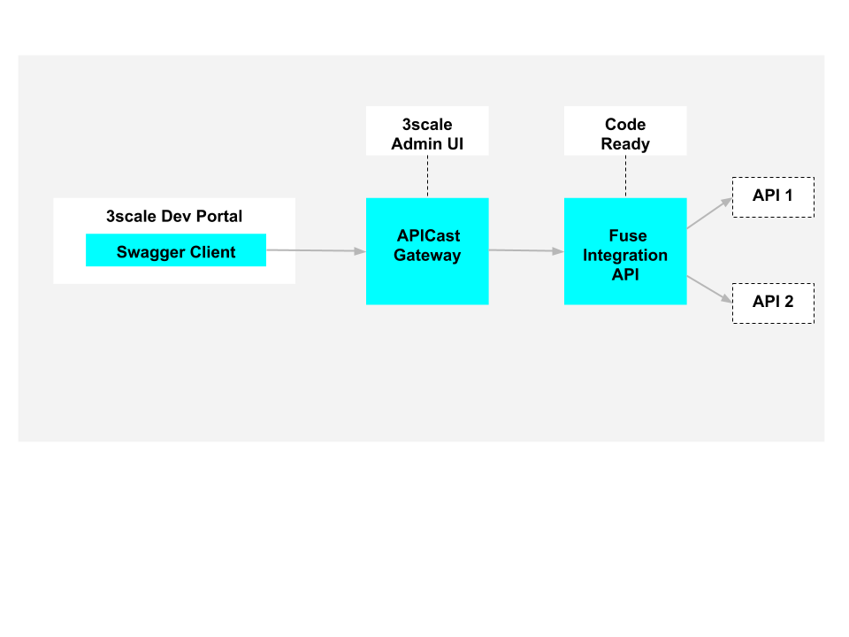

// Attributes
:integreatly: Integreatly
:messaging-service: Red Hat AMQ Online
:messaging-service-version: 7.2
:integration-service: Fuse
:integration-service-version: 7.1
:code-ready-service: Code Ready
:launcher-service: Launcher
:api-mgmt-service: 3Scale
:AMQ-ProductLongName: Red Hat AMQ
:AMQ-BrokerVersion: 7.2
:Fuse-prodnamefull: Red Hat Fuse Online
:Fuse-version: 7.1
:3Scale-ProductName: Red Hat 3scale
:3Scale-ProductVersion: 2.3
:EnMasse-master-ProductLongName: EnMasse
:fuse-flights-aggregator-app-name: fuse-flights-aggregator-{user-sanitized-username}
:walkthrough: Integrating API-driven applications

= Managing and protecting APIs using API management

:context: integrating-api-driven-applications

This walkthrough demonstrates how an API can be protected and rate limited.

Organizations modernizing their applications typically create many APIs.
It then becomes paramount to understand the usage of these APIs and to ensure they are protected, for example, from a denial-of-service (DoS) attack.
It is possible to protect and limit access to APIs as part of an integration.

In this walkthrough, you use the *Fuse Aggregation App*, which is a demonstration app that provides data using an API.
The walkthrough shows how to deploy, edit, protect and rate-limit that API, using OpenShift, {launcher-service}, {code-ready-service} and {api-mgmt-service}.

[type=walkthroughResource,serviceName=openshift]
.Red Hat OpenShift
****
* link:{openshift-host}/console[Console, window="_blank"]
* link:https://help.openshift.com/[Openshift Online Help Center, window="_blank"]
* link:https://blog.openshift.com/[Openshift Blog, window="_blank"]
****

[type=walkthroughResource,serviceName=launcher]
.Launcher
****
* link:{launcher-url}[Console, window="_blank"]
* link:https://developers.redhat.com/products/openshiftio/overview/[Launcher Overview, window="_blank"]
* link:https://launcher.fabric8.io/docs/[Launcher Documentation, window="_blank"]
****

[type=walkthroughResource,serviceName=codeready]
.Code Ready
****
* link:{che-url}[Console, window="_blank"]
* link:https://developers.redhat.com/products/codeready-workspaces/overview/[Code Ready Overview, window="_blank"]
* link:https://access.redhat.com/documentation/en-us/red_hat_codeready_workspaces_for_openshift/1.0.0/[Code Ready Documentation, window="_blank"]
****

[type=walkthroughResource,serviceName=3scale]
.3Scale
****
* link:{api-management-url}[Console, window="_blank"]
* link:https://developers.redhat.com/products/3scale/overview/[3Scale Overview, window="_blank"]
* link:https://www.3scale.net[3Scale Website, window="_blank"]
****

:sectnums:

[time=5]
== Deploying the Fuse Aggregation App

The Fuse Aggregation App provides information about flights. You deploy it using Launcher.

// TODO placeholders for product names
// TODO append /launch/wizard/<project-name> to launcher url
// TODO flights endpoint url
. Log in to the link:{launcher-url}/launch/wizard/{walkthrough-namespace}[{launcher-service}, window="_blank"] wizard.

. Select the option to *Code Locally, Build and Deploy* in the *Select Target Environment* step.

. Select the *Authorize* button to allow Launcher create resources in the OpenShift cluster. This triggers an OAuth flow, and eventually redirects back to the {launcher-service} wizard.

. Select the blue down-arrow icon to continue the wizard.

. Select the *Aggregation* mission and *Fuse* runtime in the *Select Mission & Runtime* step

. Select the blue down-arrow icon to continue the wizard.

. Authorize your Github Account
.. Select the *Log In & Authorize Account* button in the *Authorize Git Provider* step.
.. This opens a Github OAuth page.
.. Select the *Authorize <organisation/user>* button at the bottom.
.. You will be redirected back to the {launcher-service} wizard.

. Select all blue down-arrow icons to continue the wizard, accepting the git repository name.

. Select the *Set Up Application* button to create a Git repository and provision the mission resources to OpenShift. A build for the *Fuse Aggregation App* is triggered and deployed.

[type=verification]
. Are the following pods running in the link:{openshift-host}/console/project/{walkthrough-namespace}[OpenShift Project, window="_blank"]:
+
* fuse-flights-aggregator
+
* arrivals
+
* departures
// TODO: flights api links to /camel/flights
. Navigate to the link:{route-fuse-flights-aggregator-host}/camel/flights[Flights Endpoint, window="_blank"] and check that the response includes details about 8 flights.

[type=verificationFail]
Verify that you followed each step in the procedure above.  If you are still having issues, contact your administrator.

:sectnums!:

// Task resources go here

:sectnums:

[time=10]
== Modifying the Fuse Aggregation App

Modify the Fuse Aggregation App to aggregate flights data from the Arrivals & Deparatures servers

// TODO placeholders for product names
// TODO project name
. Log in to the link:{che-url}[Code Ready, window="_blank"] Dashboard

. The *New Workspace* page is displayed. Create a new Workspace:
.. Use the *Java 1.8* stack.
.. Select the *Add or Import Project* button.
.. Select the *Github* tab.
.. Select the *Connect your Github Account* button.
.. Select the checkbox beside the git repository named *{walkthrough-namespace}*. You may need to filter by account if you are a member of any Organizations.
.. Select the *Add* button to add the repository to the workspace.
.. Select the *Create* button at the bottom.
.. Select *Open in IDE*.
+
. Open the file at *src/main/java/com/redhat/fuse/boosters/rest/http/CamelRouter.java*.
+
// TODO: explain what the app is doing and why we're modifying it
+
. Comment out the routing code that talks to local java services.
.. Navigate to the section of the file with a comment of `// COMMENT OUT THIS`.
.. Comment out the line of code below this using double slashes *//*.
+
. Uncomment the routing code that talks to remote services.
.. Navigate to the section of the file with a comment of `// UNCOMMENT THIS`.
.. Uncomment the line of code below this by removing the double slashes.
+
. Before the changes can be commited and pushed to the repository, you must specify a name and email to associate with commits:
.. Select the *Profile* menu, then *Preferences*.
.. Choose the *Commiter* option under the *Git* heading.
.. Set a *Name* and *Email*.
.. Select *Save* then *Close*.

. Commit and push the changes back to the repository:
.. Select the *Git* menu, then *Commit*.
.. Ensure the *CamelRouter.java* file is checked.
.. Enter a commit message of *Switch to remote services* in the input area.
.. Check the box for *Push commited changes to* and ensure the branch is set to *master*.
.. Select the *Commit* button.
.. A green notification *Pushed to Origin* is displayed.
.. A new build will be triggered in OpenShift and rollout the new changes to the *Fuse Aggregation App*.

[type=verification]
// TODO: flights api links to /camel/flights
After waiting for the build and deployment to complete, check link:{route-fuse-flights-aggregator-host}/camel/flights[Flights Endpoint, window="_blank"]. Are more than 8 flights displayed?

[type=verificationFail]
Verify that you followed each step in the procedure above.  If you are still having issues, contact your administrator.

:sectnums!:

// Task resources go here

:sectnums:

[time=15]
== Managing the Fuse Aggregation App endpoint

=== API Management Login

// TODO service & url placeholders
. Open the link:{api-management-url}[{3Scale-ProductName} Login screen, window="_blank"].

. Select the *Red Hat Single Sign On* option. This triggers an OAuth Flow and redirects you back to the {3Scale-ProductName} Dashboard.

. Dismiss the *How does 3Scale work?* option which is displayed the first time you log in to {3Scale-ProductName}. The main Dashboard is displayed.

[type=verification]
Can you see the {3Scale-ProductName} Dashboard and navigate the main menu?

[type=verificationFail]
Verify that you followed each step in the procedure above.  If you are still having issues, contact your administrator.

=== Adding the Fuse Aggregation App Endpoint to Red Hat 3scale

. From the *Dashboard*, select the *New API* item.
. Select the *Define Manually* option.

+
// TODO: dynamic fuse aggregation app name based on user id/email. "Only ASCII letters, numbers, dashes and underscores are allowed" for System name. e.g. fuse-aggregation-app-test01-example-com
. Enter the following as the *Name* and *System name*:
+
[subs="attributes+"]
----
{fuse-flights-aggregator-app-name}
----

. Leave the *Description* field empty.

. Select *Add API* at the bottom of the screen.

. From the *Overview* screen, select the *Configure APIcast* button.
// The 'fuse-aggregation-app-url' should be the url of the Fuse Aggregation App e.g. https://fuse-flights-aggregator-ak49.cluster-lfa3xlh.opentry.me/
. In the *Private Base URL* field, enter:
+
[subs="attributes+"]
----
{route-fuse-flights-aggregator-host}
----
// The '{fuse-aggregation-app-apicast-route-url}' shoudl be the apicast-staging route url for this specific user. It can be looked up or deterministicly set.
. In the *Staging Public Base URL*, enter:
+
[subs="attributes+"]
----
https://wt2-{user-sanitized-username}-3scale.{openshift-app-host}
----
+
This route should point to the shared staging APIcast in the *3scale* project in OpenShift.  Your administrator should have created this route for you. If it does not exist, contact your administrator to create the route.

. Select *Update & test in Staging Environment*

[type=verification]
Is the API service available?
You might encounter a *403: Authentication failed* message. You can ignore this message, the issue is resolved in a later step.

[type=verificationFail]
Verify that you followed each step in the procedure above.  If you are still having issues, contact your administrator.

=== Setting Fuse Aggregation App Endpoint Limits

. Create a new *Application Plan*:
.. Select *Applications > Application Plans* from the side navigation.
.. Select *Create Application Plan*.
.. Enter the following for *Name* and *System name*:
+
[subs="attributes+"]
----
{fuse-flights-aggregator-app-name}
----
.. Leave the other fields with their default values.
.. Select *Create Application Plan*. You will be redirected to the *Application Plans* screen.
.. Select the *Publish* button, beside your plan list item, to publish the Plan.

. Select the *{fuse-flights-aggregator-app-name}* plan in the list to return to the edit screen.

. Set a limit of 5 calls per hour:
.. From the *Metrics, Methods, Limits & Pricing Rules* section, select the *Limits (0)* button.
.. Select the *New usage limit* button.
.. Set the *Period* to *hour*.
.. Set the *Max. value* to *5*.
.. Select *Create usage limit*.
.. Select *Update Application plan*

. Create a new *Application* for the *Developer* Group, assigned to the Plan:
.. Select *Audience* from the top navigation bar dropdown.
.. Select the *Developer* Account to open the *Account Summary* page.
.. Select the *(num) Application* item from the breadcrumb to view Applications.
.. Select the *Create Application* button in the top right.
.. Select the *{fuse-flights-aggregator-app-name}* Plan in the *Application plan* dropdown.
.. Enter the following for *Name* and *Description*:
+
[subs="attributes+"]
----
{fuse-flights-aggregator-app-name}
----
.. Select *Create Application*.

. Set a custom *User Key* for the application:
.. On the *{fuse-flights-aggregator-app-name}* application screen you were redirected to, scroll to the *API Credentials* section.
.. Click the green pencil icon beside the *API User Key*
.. In the *Set Custom User Key* modal dialog, enter:
+
[subs="attributes+"]
----
{fuse-flights-aggregator-app-name}
----
.. Select *Set Custom Key*.

[type=verification]
****
. Select the *Overview* menu item in the side navigation.

. Scroll down and select the *Configure APIcast* button in the bottom right.

. Select the *Update & test in Staging Environment* button at the bottom again.

. Is a success message displayed and a green line along the left side of the page visible?
****

[type=verificationFail]
Verify that you followed each step in the procedure above.  If you are still having issues, contact your administrator.

[id='fuse-aggregation-app-endpoint-activedocs_{context}']

[type=taskResource]
.Task Resources
****
* link:https://access.redhat.com/documentation/en-us/red_hat_3scale/2-saas/html-single/access_control/index[Access Control and Application Plans, window="_blank"]
****

[.integr8ly-docs-header]
=== Create a new ActiveDocs Service

. Select *Active Docs* from the side navigation.

. Select *Create your first spec*

. Enter the following for *Name* and *System name*:
+
[subs="attributes+"]
----
{fuse-flights-aggregator-app-name}
----

. Enter the below content for the *API JSON Spec*.
+
[subs="attributes"]
----
{
  "swagger" : "2.0",
  "info" : {
    "version" : "1.0",
    "title" : "Airport Flights REST API"
  },
  "host" : "wt2-{user-sanitized-username}-3scale.{openshift-app-host}",
  "basePath" : "/camel/",
  "tags" : [ {
    "name" : "flights",
    "description" : "List all flights (arrivals & departures)"
  } ],
  "schemes" : [ "https" ],
  "paths" : {
    "/flights" : {
      "get" : {
        "tags" : [ "flights" ],
        "operationId" : "flights-api",
        "parameters" : [ {
          "name" : "user_key",
          "in" : "query",
          "description" : "User Key, if calling the API in front of 3Scale.",
          "required" : false,
          "type" : "string",
          "x-data-threescale-name": "user_keys"
        } ],
        "responses" : {
          "200" : {
            "description" : "Output type",
            "schema" : {
              "type" : "string",
              "format" : "com.redhat.fuse.boosters.rest.http.FlightsList"
            }
          }
        }
      }
    }
  },
  "definitions" : {
    "Flight" : {
      "type" : "object",
      "properties" : {
        "code" : {
          "type" : "string"
        },
        "time" : {
          "type" : "integer",
          "format" : "int64"
        },
        "flightType" : {
          "type" : "string"
        }
      }
    }
  }
}
----
// TODO: spec from fuse aggregation app, with 2 modifications:
//     - 'host' field set to the fuse-aggregation-app-apicast-route-url attribute
//     - add a field to the 'user_key' parameter, 'x-data-threescale-name' with value of 'user_keys' (needed for autofill later)
//
// The swagger spec comes from the /camel/api-doc endpoint in the fuse-aggregation app. e.g.
+
////
{
  "swagger" : "2.0",
  "info" : {
    "version" : "1.0",
    "title" : "Airport Flights REST API"
  },
  "host" : "wt2-f2-3scale-apicast-staging-3scale-3scale.cluster-lfa3xlh.opentry.me",
  "basePath" : "/camel/",
  "tags" : [ {
    "name" : "flights",
    "description" : "List all flights (arrivals & departures)"
  } ],
  "schemes" : [ "https" ],
  "paths" : {
    "/flights" : {
      "get" : {
        "tags" : [ "flights" ],
        "operationId" : "flights-api",
        "parameters" : [ {
          "name" : "user_key",
          "in" : "query",
          "description" : "User Key, if calling the API in front of 3Scale.",
          "required" : false,
          "type" : "string",
          "x-data-threescale-name": "user_keys"
        } ],
        "responses" : {
          "200" : {
            "description" : "Output type",
            "schema" : {
              "type" : "string",
              "format" : "com.redhat.fuse.boosters.rest.http.FlightsList"
            }
          }
        }
      }
    }
  },
  "definitions" : {
    "Flight" : {
      "type" : "object",
      "properties" : {
        "code" : {
          "type" : "string"
        },
        "time" : {
          "type" : "integer",
          "format" : "int64"
        },
        "flightType" : {
          "type" : "string"
        }
      }
    }
  }
}
////
+
. Select the *Create Service* button.

[type=verification]
Does the *Airport Flights REST API* ActiveDoc exist with a *List all flights* API endpoint?

[type=verificationFail]
Verify that you followed each step in the procedure above.  If you are still having issues, contact your administrator.

:sectnums!:

// Task resources go here

:sectnums:

[time=30]
== Calling Fuse Aggregation App endpoint

=== Checking the API Service is protected

. From the *ActiveDocs* page for the *{fuse-flights-aggregator-app-name}* Application, expand the *GET /flights* endpoint.
. Leave the *user_key* field empty.
. Select the *Try it out!* button.

[type=verification]
****
Is {3Scale-ProductName} rejecting the request, because no `user_key` was specified?

* The *Response Body* is `no content`

* The *Response Code* is 0
****

[type=verificationFail]
Verify that you followed each step in the procedure above.  If you are still having issues, contact your administrator.

=== Validating access to the API Service

. In the *user_key* field, enter:
+
[subs="attributes+"]
----
{fuse-flights-aggregator-app-name}
----
. Select the *Try it out!* button.

[type=verification]
****
Check that:

* the *Response Code* is 200
* the *Response Body* shows a *JSON Array* of flights

Are these responses displayed?
****

[type=verificationFail]
Verify that you followed each step in the procedure above.  If you are still having issues, contact your administrator.

=== Verifying access to the API Service is limited

. In the *user_key* field, enter:
+
[subs="attributes+"]
----
{fuse-flights-aggregator-app-name}
----
. Click the *Try it out!* button repeatedly until the *Response Code* is *0*, this
should happen after the fifth click (the hourly limit set earlier).
. Select the *Applications > Listing* from the sidemenu.
. Select the *{fuse-flights-aggregator-app-name}* application from the *Applications* list.
. Scroll down to the *Current Utilization* section.

[type=verification]
****
Is the following displayed:

* *Hits %* in the *Current Utilization* section is `100%`.
****

[type=verificationFail]
Verify that you followed each step in the procedure above.  If you are still having issues, contact your administrator.

=== Monitoring the API Service

. Select the *Analytics > Usage* from the sidemenu

[type=verification]
Do the analytics charts show the service requests?

[type=verificationFail]
Verify that you followed each step in the procedure above.  If you are still having issues, contact your administrator.
