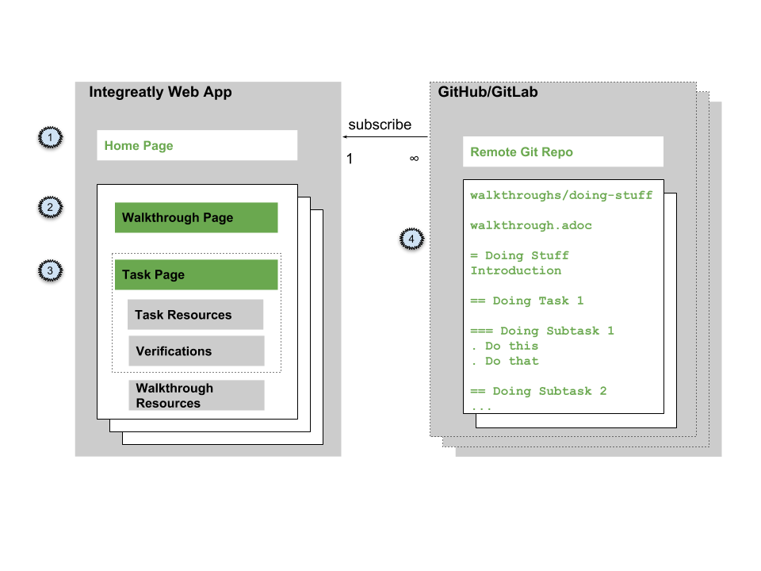

:linkGettingStarted: https://docs.google.com/document/d/1lSb481fCiec0aTlJAw8cRLn_AiQjNgbCZsqq6wWfdWE/edit
:linkTroubleshooting: https://github.com/integr8ly/example-customisations/blob/master/docs/troubleshooting.adoc
:linkGitHubFork: https://help.github.com/articles/fork-a-repo/
:linkIndexURL: https://github.com/integr8ly/example-customisations/blob/master/index.adoc

// Placeholder for link to docs about writing walkthroughs
:linkWriting: na yet

= Adding walkthroughs to a cluster

How to add to the catalog of walkthroughs in your environment by subscribing to remote git repositories.

In addition to the default walkthroughs, you can import existing walkthroughs from a git repository. 
If the git repository changes you can redeploy the web app to publish the changes. 
You can specify a branch on the git repository, if you do not want to add the default branch.

NOTE: You must have access to the link:{openshift-host}[OpenShift Console].

[type=walkthroughResource]
.Links
****
* link:{linkGettingStarted}[Getting Started, window="_blank"]
* link:{linkTroubleshooting}[Troubleshooting, window="_blank"]
****

:sectnums:

[time=5]
== Understanding walkthroughs

. The home page of the web app lists all the walkthoughs from all the git repositories you are subscribed to.
. The introduction to a walkthrough provides the context and the necessary information for you to decide whether to perform the steps. On the right hand side of the page, a set of links is displayed, named *Walkthrough Resources*.
. Each walkthrough displays a set of tasks that you must perform, each with associated links, *Task Resources* and verification steps that you must complete to proceed.
. Each git repository must contain a `walkthroughs` directory and each subdirectory acts as an ID for the walkthrough. Note that an error is reported if two walkthroughs have the same ID. 

[time=10]
== Finding walkthroughs

Walkthroughs are available from git repositories, typically hosted on GitHub or GitLab. 

A git repository typically contains many walkthroughs.

See the link:{linkIndexURL}[index of walkthrough repositories] for more information.

=== Forking walkthrough repositories

To have precise control over what is published in your environment, create a fork of the git repository you want to use. This allows you to:

* delete walkthroughs before publication
* add additional walkthroughs that you have written

To create a fork of the walkthrough repository you want to add to your cluster:

. Log into the git hosting service.
. Navigate to the repository you want to fork.
. Fork the repository using the instructions from the git hosting service, for example, link:{linkGitHubFork}[GitHub instructions].

[type=verification]
Have you identified a URL for one or more repositories with the exact content you want to publish?

[type=verificationFail]
Continue searching, new walkthroughs are created on GitHub monthly and the link:{linkIndexURL}[index of walkthrough repositories] is updated. 

[time=10]
== Adding a git repository to the Webapp

For each repository URL that you have from Task 1:

. Open the link:{openshift-host}[Openshift Console].

. Navigate to the *webapp* project.

. Choose *Other Resources* from the *Resources* menu.

. Choose *Web App* from the *Other Resources* menu. 
The tutorial-web-app-operator entry is displayed.

. Choose *Edit YAML* from the *Actions* menu.
An editor is displayed.

. Find the *Spec* > *Template* > *Parameters* entries in the YAML.
. Create or edit the `WALKTHROUGH_LOCATIONS` parameter to include the repositories that you want to use, for example:
+
----
WALKTHROUGH_LOCATIONS: https://github.com/integr8ly/tutorial-web-app-walkthroughs.git,https://github.com/integr8ly/example-customisations.git#master
----
+
[NOTE]
====
* Make sure there are no space characters in the value of the *WALKTHROUGH_LOCATIONS*.
* Include the `https://github.com/integr8ly/tutorial-web-app-walkthroughs.git` to ensure the core walkthroughs are displayed.
====
+
Editing the value triggers an automatic redeployment of the Webapp.

. When the deployment is complete, refresh the Webapp in your Browser.
+
You should now see new walkthroughs available from the dashboard.
+
[NOTE]
====
If the git repository is updated with new content, the web app is not automatically updated. You must:

. Open the link:{openshift-host}[Openshift Console].

. Find and open the *webapp* project.

. Find and open the *tutorial-web-app* deployment.
. Click the *Deploy* button.

====

[type=verification]
Are the walkthroughs you require displayed on the web app dashboard?

[type=verificationFail]
Check that the Webapp has finished redeployment and no errors occurred. For information on debugging, see the link:{linkTroubleshooting}[Troubleshooting Guide]. 
